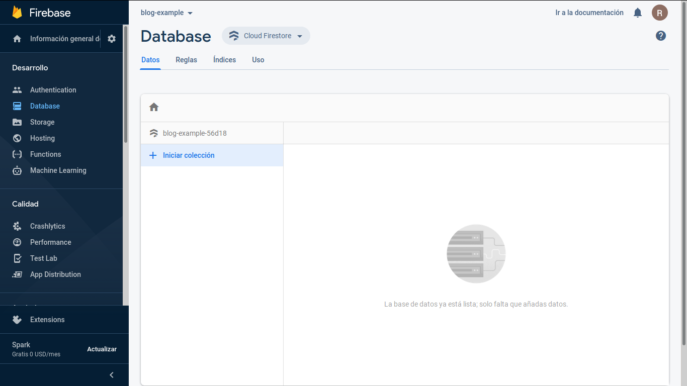
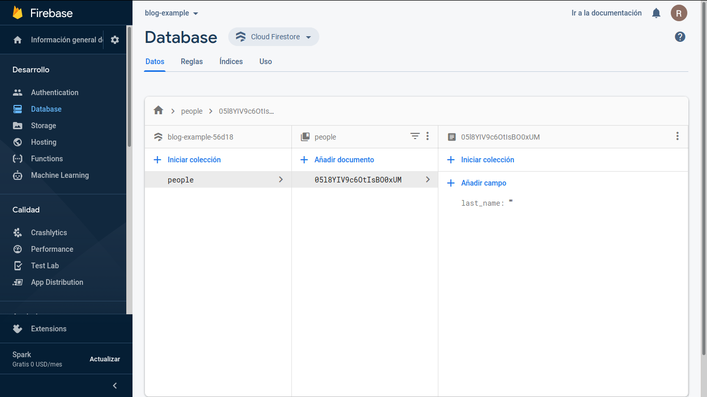

# Fundamentos de Bases de Datos

## Conceptos básicos y contexto histórico de las bases de datos
El almacenamiento en la nube tiene un gran pro comparada con los otros métodos de almacenamiento ya que es accesible desde cualquier parte del mundo. Además es centralizada y puede ser usada por varias personas al mismo tiempo.

Las bases de datos entran cuando hacemos la transición a medios digitales.

**Tipos de bases de datos:**

- Relacionales: En la industria hay varias compañías dedicadas a ser manejadoras de bases de datos relacionales como SQL Server, Oracle, MariaDB, entre otras.

- No relacionales: Todavía están avanzando y existen ejemplos muy distintos como cassandra, elasticsearch, neo4j, MongoDB, entre otras.


**Servicios:**

- Auto administrados: Es la base de datos que instalas tú y te encargas de actualizaciones, mantenimiento, etc.

- Administrados: Servicios que ofrecen las nubes modernas como Azure y no debes preocuparte por mantenimiento o actualizaciones.

## Introducción a las bases de datos relacionales
### Historia de las RDB
Es importante que sea fácil de guardar y extraer, anteriormente se usaban bases de datos basadas en archivos, el cuál era texto plano fácil de guardar, pero difícil de extraer, por esto se inventaron las bases de datos relacionales. En 1990 Codd se preocupó porque los sistemas de gestión de bases de datos (SGB4. que decían ser relacionales, no lo eran. En la práctica es difícil cumplir las 12 pero, un SGBD es más relacional cuantas más reglas cumpla.

Las Reglas y mandamientos de Edgar Frank Ted Codd son:


- Regla 0: Regla de fundación.
    1. Cualquier sistema que se proclame como relacional, debe ser capaz de gestionar sus bases de datos enteramente mediante sus capacidades relacionales.

- Regla 1: Regla de la información.
    1. Todos los datos deben estar almacenados en las tablas
    2. Esas tablas deben cumplir las premisas del modelo relacional
    3. No puede haber información a la que accedemos por otra vía

- Regla 2: Regla del acceso garantizado.
    1. Cualquier dato es accesible sabiendo la clave de su fila y el nombre de su columna o atributo
    2. Si a un dato no podemos acceder de esta forma, no estamos usando un modelo relacional

- Regla 3: Regla del tratamiento sistemático de valores nulos.
    1. Esos valores pueden dar significado a la columna que los     contiene
    2. El SGBD debe tener la capacidad de manejar valores nulos
    3. El SGBD reconocerá este valor diferenciándolo de cualquier otro
    4. El SGBD deberá aplicársele la lógica apropiada
    5. Es un valor independiente del tipo de datos de la columna

- Regla 4: Catálogo dinámico en línea basado en el modelo relacional.
    1. El catálogo en línea es el diccionario de datos
    2. El diccionario de datos se debe de poder consultar usando las mismas técnicas que para los datos
    3. Los metadatos, por tanto, se organizan también en tablas relacionales
    4. Si SELECT es una instrucción que consulta datos, también será la que consulta los metadatos

- Regla 5: Regla comprensiva del sublenguaje de los datos completo.
    1. Al menos tiene que existir un lenguaje capaz de hacer todas las funciones del SGBD
    2. No puede haber funciones fuera de ese lenguaje
    3. Puede haber otros lenguajes en el SGBD para hacer ciertas tareas
    4. Pero esas tareas también se deben poder hacer con el "lenguaje completo"

- Regla 6: Regla de actualización de vistas.
    1. Las vistas tienen que mostrar información actualizada
    2. No puede haber diferencias entre los datos de las vistas y los datos de las tablas base

- Regla 7: Alto nivel de inserción, actualización, y cancelación.
    1. La idea es que el lenguaje que maneja la base de datos sea muy humano
    2. Eso implica que las operaciones del lenguaje de manipulación de los datos (DML) trabajen con conjuntos de filas a la vez
    3. Para modificar, eliminar o añadir datos, no hará falta programar de la forma en la que lo hacen los lenguajes de tercerageneración como C o Java

- Regla 8: Independencia física de los datos.
    1. Cambios en la física de la BD no afecta a las aplicaciones ni a los esquemas lógicos
    2. El acceso a las tablas (elemento lógico) no cambia porque la física de la base de datos cambie

- Regla 9: Independencias lógicas de los datos.
    1. Cambios en el esquema lógico (tablas) de la BD no afectan al resto de esquemas
    2. Si cambiamos nombres de tabla, o de columna o modificamos información de las filas, las aplicaciones (esquema externo) no seven afectadas
    3. Es más difícil de conseguir

- Regla 10: Independencia de la integridad.
    1. Las reglas de integridad (restricciones) deben de ser gestionadas y almacenadas por el SGBD

- Regla 11: Independencia de la distribución.
    1. Que la base de datos se almacene o gestione de forma distribuida en varios servidores, no afecta al uso de esta ni a laprogramación de las aplicaciones de usuario
    2. El esquema lógico es el mismo independientemente de si la BD es distribuida o no

- Regla 12: La regla de la no subversión.
    1. La base de datos no permitirá que exista un lenguaje o forma de acceso, que permita saltarse las reglas anteriores

### Entidades y atributos
Una entidad es una representación de la vida real, algo similar a los objetos en programación; los atributos son las características que hacen lo hacen ser una entidad. Una entidad puede tener atributos multivaluados, es decir, aquellos atributos que pueden ser más de uno, entiéndase, las llantas de un carro. A los atributos que están formados a su vez de otros atributos, se les llama atributos compuestos (por ejemplo, un atributo de un carro puede ser su motor, el cual a su vez, está formado por otros atributos).

Existen dos tipos de entidades:

- Entidades fuertes: no dependen de otra entidad para existir.
- Entidad débiles: dependen de otra entidad para existir (por ejemplo, en una biblioteca no se puede tener el ejemplar de un libro que no existe. Una entidad puede ser débil por identidad, es decir, la entidad débil depende del identificador de la entidad fuerte a la que está relacionada; una entidad también puede ser débil por cantidad, es decir, se le asigna un identificador único a la entidad, y aunque ésta tiene su propio identificador, no podría existir sin la existencia de una entidad fuerte.

### Relaciones
Las relaciones es la manera en las que se ligan las entidades u objetos; las relaciones por convención se nombran con verbos. Podemos, por ejemplo, relacionar las entidades «Jugadores» y «Equipos» mediante la relación «pertenece», es decir, un jugador pertence a un equipo.

La cardinalidad se refiere a la cantidad de las relaciones entre entidades, es decir, cuántas de un lado y cuántas del otro; existen varios tipos de cardinalidad:

- Cardinalidad 1 a 1
- Cardinalidad 0 a 1 o 1 a 1 opcional
- Cardinalidad 1 a N
- Cardinalidad 0 a N o 1 a N opcional

### Múltiples muchos
Es un tipo de cardinalidad especial, es una cardinalidad N a N, es decir, muchos a muchos. Por ejemplo, la entidad «Alumnos» puede pertenecer a «Clases» y también, una entidad «Clases» puede contener muchas entidades «Alumnos».

### Diagrama físico: tipos de datos y constraints
El siguiente paso al diagrama entidad-relación es el diagrama físico; primero veamos los tipos de datos:

| Texto      | Números       | Fecha/Hora | Lógicos |
|------------|---------------|------------|---------|
| CHAR(n)    | INTEGER       | DATE       | BOOLEAN |
| VARCHAR(n) | BIGINT        | TIME       |         |
| TEXT       | SMALLINT      | DATETIME   |         |
|            | DECIMAL(n, s) | TIMESTAMP  |         |
|            | NUMERIC(n, s) |            |         |

Otra cosa fundamental para la creación de un diagrama físico son los constraints (restricciones):

| Constraint  | Descripción                                                     |
|-------------|-----------------------------------------------------------------|
| NOT NULL    | Se asegura que la columna no tenga valores nulos                |
| UNIQUE      | Se asegura que cada valor en la columna no se repita            |
| PRIMARY KEY | Es una combinación de NOT NULL y UNIQUE                         |
| FOREING KEY | Identifica de manera única una tupla en otra tabla              |
| CHECK       | Se asegura que el valor en la columna cumpla una condición dada |
| DEFAULT     | Coloca un valor por defecto cuando no hay un valor especificado |
| INDEX       | Se crea por la columna para permitir búsquedas más rápidas      |

### Diagrama físico: normalización
La normalización como su nombre lo indica,nos ayuda a dejar todo en una forma normal. Observemos la siguiente tabla:

| alumno | nivel_curso  | nombre_curso     | materia_1 | materia_2 |
|--------|--------------|------------------|-----------|-----------|
| Jan    | Maestría     | Data Engineering | MySQL     | Python    |
| José   | Licenciatura | Programación     | MYSQL     | Python    |

- Primera forma normal (1FN): Atributos atómicos, es decir, sin campos repetidos. Aplicando la primera forma normal a nuestra tabla, el resultado es el siguiente.

| alumnos   |        |              |                  |         |
|-----------|--------|--------------|------------------|---------|
| alumno_id | alumno | nivel_curso  | nombre_curso     | materia |
| 1         | Jan    | Maestría     | Data Engineering | MySQL   |
| 1         | Jan    | Maestría     | Data Engineering | Python  |
| 2         | José   | Licenciatura | Programación     | MySQL   |
| 2         | José   | Licenciatura | Programación     | Python  |

- Segunda forma normal (2FN): Cumple 1FN y cada campo de la tabla debe depender de una clave única. La segunda regla nos indica la separación de nuestra tabla. La razón de la separación es que conceptualmente los alumnos y las materias son dos cosas totalmente distintas.

| alumnos   |        |              |                  |
|-----------|--------|--------------|------------------|
| alumno_id | alumno | nivel_curso  | nombre_curso     |
| 1         | Jan    | Maestría     | Data Engineering |
| 1         | Jan    | Maestría     | Data Engineering |
| 2         | José   | Licenciatura | Programación     |
| 2         | José   | Licenciatura | Programación     |

| materias   |           |         |
|------------|-----------|---------|
| materia_id | alumno_id | materia |
| 1          | 1         | MySQL   |
| 2          | 1         | Python  |
| 3          | 2         | MySQL   |
| 4          | 2         | Python  |

- Tercera forma normal (3FN): Cumple 1FN y 2FN y los campos que NO son clave NO deben tener dependencias. Jan no tiene intrínsecamente ligada la maestría, por lo tanto se puede manejar como una entidad distinta.

| alumnos   |        |           |
|-----------|--------|-----------|
| alumno_id | alumno | curso_id  |
| 1         | Jan    | 1         |
| 1         | Jan    | 2         |

| cursos   |              |                  |
|----------|--------------|------------------|
| curso_id | nivel_curso  | nombre_curso     |
| 1        | Maestría     | Data Engineering |
| 1        | Licenciatura | Programación     |

| materias   |           |         |
|------------|-----------|---------|
| materia_id | alumno_id | materia |
| 1          | 1         | MySQL   |
| 2          | 1         | Python  |
| 3          | 2         | MySQL   |
| 4          | 2         | Python  |

- Cuarta forma normal (4FN): Cumple 1FN, 2FN y 3FN; los campos multivaluados se identifican por una clave única.

| alumnos   |        |           |
|-----------|--------|-----------|
| alumno_id | alumno | curso_id  |
| 1         | Jan    | 1         |
| 1         | Jan    | 2         |

| cursos   |              |                  |
|----------|--------------|------------------|
| curso_id | nivel_curso  | nombre_curso     |
| 1        | Maestría     | Data Engineering |
| 1        | Licenciatura | Programación     |

| materias   |         |
|------------|---------|
| materia_id | materia |
| 1          | MySQL   |
| 2          | Python  |
| 3          | MySQL   |
| 4          | Python  |

| materia_por_alumno |            |           |
|--------------------|------------|-----------|
| mpa_id             | materia_id | alumno_id |
| 1                  | 1          | 1         |
| 2                  | 2          | 1         |
| 3                  | 1          | 2         |
| 4                  | 2          | 2         |

## RDBMS
Relational Database Management System, es un un sistema que permite crear, editar y administrar una base de datos relacional. En su gran mayoría usan el Lenguaje de Consultas Estructuradas (SQL).

## SQL
### Historia de SQL
Structured Query Language, se crea con la idea de hacer consultas a bases de datos con un lenguaje estandarizado y que pudiese ser usado independientemente del manejador de bases de datos.

### DDL
Data Definition Language, es un lenguaje que nos ayuda a crear la estructura de una base de datos. Existen tres grandes comandos: 
- `create`: nos ayuda a crear tablas, vistas, índices, etc.
- `alter`: nos ayuda a alterar o modificar alguna de las entidades mencionadas.
- `drop`: nos ayuda a borrar.

Para el comando `create` tenemos tres grandes grupos:
- Bases de datos: repositorio de datos que usa un proyecto.
- Tablas: son la proyección de las entidades.
- Vistas: la proyección de la base de datos de una forma entendible.

### DDL VIEW y DDL ALTER
Una vista es un concepto útil que sirven para tomar datos de la base de datos, ponerlas en una forma presentable y permite que se consulte de manera recurrente. A continuación se muestra un ejemplo de la creación de una vista:

```mysql
CRETE VIEW v_brasil_customers AS
    SELECT customer_name, contact_name
    FROM customers
    WHERE country = "Brasil";
```

`ALTER` nos permite modificar nuestra base de datos. A continuación se muestra un ejemplo del uso de `ALTER`:

```mysql
ALTER TABLE people
ADD date_of_birth date;

ALTER TABLE people
ALTER COLUMN date_of_birth year;

ALTER TABLE people
DROP COLUMN date_of_birth;
```

### DDL DROP
Se trata de una de las sentencias más peligrosas de SQL, permite la eliminación de lo que se le indica, veamos un ejemplo:

```mysql
DROP TABLE people;

DROP DATABASE test_db;
```

### DML
Data Manipulation Language, maneja el contenido de la base de datos. Existen cuatro grandes comandos:

- `insert`: permite insertar un nuevo registro o tupla a la base de datos. A continuación se muestra un ejemplo:

```mysql
INSERT INTO people (last_name, first_name, address, city)

VALUES ('Hernández', 'Laura', 'Calle 21', 'Monterrey'),
VALUES ('Guerrero', 'Alfonso', 'Calle 83', 'Hidalgo');
```

- `update`: permite actualizar los datos existentes, `update` no inserta datos que no existan. A continuación se muestra un ejemplo:

```mysql
UPDATE people
SET last_name = 'Chávez', city = 'Mérida'
WHERE person_id = 1;

UPDATE people
SET first_name = 'Juan'
WHERE city = 'Mérida'

-- Si no se especifíca una cláusula WHERE, corremos el riegos de modificar de forma masiva nuestra base de datos
UPDATE people
SET first_name = 'Juan';
```

- `delete`: puede borrar el contenido de una tabla. A continuación se muestra un ejemplo:

```mysql
DELETE FROM people
WHERE person_id = 1;

-- Borra todo el contenido de la tabla
DELETE FROM people;
```

- `select`: trae información de la base de datos, para poder modificar la información de la base de datos, primero se tiene que traer. A continuación se muestra un ejemplo:

```mysql
SELECT first_name, last_name
FROM people;
```

## Consultas a una base de datos
### ¿Por qué las consultas son tan importantes?
Las consultas en una base de datos juegan un papel muy fundamental, puesto que facilitan de manera considerable los procesos en cualquier empresa.

ETL (Extract Transform Loa4. hace parte del proceso de integración de datos, mas aun es un componente muy importante que completa el resultado final en la relación de aplicaciones y sistemas.

### Estructura básica de un query
Las queries son la forma en la que se estructuran las preguntas a la base de datos para que nos traiga la información requerida.

```mysql
SELECT * -- selecciona todas las columnas
FROM people -- tabla de la cual se extraé la información
```

### SELECT
La sentencia `SELECT` nos permite filtrar la información que solicitamos a la base de datos. Un `SELECT` debe tener como mínimo un `FROM` para poder funcionar. Podemos usar un alias para hacer más legible el resultado de nuestra consulta, esto se logra agregando `AS` a un lado de nuestro atributo.

```mysql
SELECT
    title AS Header,
    pub_date AS Published
FROM posts;
```

`SELECT` nos permite usar datos que se crean en el momento.

```mysql
SELECT COUNT(*) AS NumberOfPosts
FROM posts;
```

### FROM
Indica de dónde se deben traer los datos y puede ayudar a hacer sentencias y filtros complejos cuando se quieren unir tablas. La sentencia compañera que nos ayuda con este proceso es `JOIN`.

Los diagramas de Venn son círculos que se tocan en algún punto para ver dónde está la intersección de conjuntos. Ayudan mucho para poder formular la sentencia `JOIN` de la manera adecuada dependiendo del query que se quiere hacer.

### WHERE
Nos ayuda a filtrar registros (filas de la tabl1.. Podemos filtrar por ejemplo, a partir de cierto numero de ID (con el operador de mayor o menor).

- `LIKE`: cuando no conocemos la cadena exacta, podemos filtrar según alguna caracteristica. Por ejemplo:

    `WHERE title LIKE '%scandal%'` lo que hace es buscar aquellos títulos que tengan la palabra escandalo en alguna parte. Sin embargo, como los signos porcentuales indican que hay algo mas, si quitamos, por ejemplo, el del final (quedando `'%scandal'`), estaremos buscando aquellos títulos que terminen con la palabra «escándalo», ya que indicamos que después de esta palabra no hay nada más.

- `BETWEEN`: la traducción de esta palabra al español es «entre». Por lo tanto, como podemos imaginar, filtrará entre dos valores a designar. Por ejemplo:

    `WHERE pub_date BETWEEN '2019-01-01' AND '2019-01-10'` filtrará las publicaciones con fecha de publicación entre el 1 de enero de 2019 y 10 de enero de 2019. Puede utilizarse tambien con valores numéricos (y por lo tanto, por ejemplo, con los IDs).

### WHERE (NULL y NOT NULL)
`NULL` no corresponde a ningún valor en particular, sino a una "ausencia" de valor, por lo tanto un `NOT NULL` correspondería a que no hay una aparente ausencia, es decir, existe un valor así sea un 0. `NULL` no es igual a nada por lo que en SQL no se le puede asociar con el operador igual que, en vez de esto se le atribuye en un `WHERE` con un `IS NULL`. Para valores `NOT NULL`, también se aplica la misma sintaxis. Para agregar un criterio adicional con `WHERE`, se usa `AND`.

### GROUP BY
`GROUP BY` nos permite hacer consultas mucho mas organizadas, de manera que la consulta se ejecuta dividida por los diferentes valores que posee la columna, de esta manera podemos determinar no solo el número de valores diferentes que puede tener un atributo, sino muchos otros parámetros como la cantidad de los mismos (con `COUNT(*)`).

```mysql
SELECT status, SUM(i4. id_sum
FROM posts
GROUP BY status;
```

### ORDER BY y HAVING
A través de `ORDER BY` podemos ordenar nuestras consultas mediante criterios que podemos asignar mediante esta sentencia. Con la palabra reservada `ASC`, podemos ordenar nuestra consulta de manera ascendente, y a través de la palabra reservada `DESC`, podemos ordenar la misma de forma descendente. Ambas sentencias funcionan de manera similar tanto para letras como para números, en el caso de las letras, si es de forma ascendente, las letras irán por orden alfabetico de la A a la Z.

`HAVING` nos permite hacer lo similar a un `WHERE`, a diferencia de que `WHERE` no es posible usarlo cuando estamos haciendo consultas con agrupaciones, cosa que si se puede hacer con `HAVING`.

### El interminable agujero de conejo (Nested queries)
Una nested query sirve para hacer una consulta dentro de otra consulta (normalmente dentro de la sentencia FROM o WHER5., esto funciona como alternativa para los JOIN o como condicional de un query dentro de otro. La profundidad de un nested query es infinita, por lo que se pueden hacer infinidad de consultas dentro de otras. El punto negativo de esto, es que puede volverse lento a la hora de ejecutar.

- Las consultas anidadas son la mejor opción cuando los valores dependen de otras tablas, y estas no se encuentran relacionadas entre sí.

- Las consultas anidadas son la mejor opción para casos de INSERT, DELETE, UPDATE, cuya condición dependa del escenario explicado en el punto anterior.

- Los JOINS son la mejor opción para casos de SELECT.

### ¿Cómo convertir una pregunta en un query SQL?
- `SELECT`: lo que quieres mostrar.
- `FROM`: de dónde voy a tomar los datos.
- `GROUP BY`: los rubros por los que me interesa agrupar la información.
- `ORDER BY`: el orden en que quiero representar mi información.
- `HAVING`: los filtros que quiero que mis datos agrupados tengan.

## Introducción a las bases de datos NO relacionales
### ¿Qué son y cuáles son los tipos de bases de datos no relacionales?
Las bases de datos no relacionales (a veces llamadas NoSQL, es decir no solo SQL) contienen una amplia gama de DBMSs que difieren del modelo de bases de datos relacionales y como característica más destacada es que no usan SQL como su lenguaje principal para consultas. Entre todas estas tenemos:


- Clave - valor: Son ideales para almacenar y extraer datos con una clave única. Manejan los diccionarios de manera excepcional. Ejemplos: DynamoDB, Cassandra.

- Basadas en documentos: Son una implementación de clave valor que varía en la forma semiestructurada en que se trata la información. Ideal para almacenar datos JSON y XML. Ejemplos: MongoDB, Firestore.

- Basadas en grafos: Basadas en teoría de grafos, sirven para entidades que se encuentran interconectadas por múltiples relaciones. Ideales para almacenar relaciones complejas. Ejemplos: neo4j, TITAN.

- En memoria: Pueden ser de estructura variada, pero su ventaja radica en la velocidad, ya que al vivir en memoria la extracción de datos es casi inmediata. Ejemplos: Memcached, Redis.

- Optimizadas para búsquedas: Pueden ser de diversas estructuras, su ventaja radica en que se pueden hacer queries y búsquedas complejas de manera sencilla. Ejemplos: BigQuery, Elasticsearch.

### Servicios administrados y jerarquía de datos
Firebase es una plataforma de Google para el desarrollo de aplicaciones web y móviles a modo de BaaS (Backend as Servic5.. Firebase ofrece 2 servicios para bases de datos, los cuales son Realtime Database y Cloud Firestore.

La jerarquía de datos consta primeramente de la base de datos como tal, seguido ya no de tablas, sino de colecciones y finalmente los documentos como tal y que correspondería a una tupla en una base de datos basada en SQL.

Cloud Firestore es uno de los servicios de Firestore en bases de datos, que se basa en **documentos**, sus características principales son la flexibilidad, escalabilidad para programar en servers, dispositivos móviles y para la web desde Firebase y Google Cloud.

## Manejo de modelos de datos en bases de datos no relacionales
### Top level collection con Firebase
1. Accedemos a la consola de Firebase con nuestras credenciales de Google y hacemos clic sobre "Crear proyecto".


2. Le ponemos un nombre a nuestro proyecto, debe ser un ID único, por lo tanto, si hay algún proyecto que ya tenga el nombre que queremos, Google modificará el nombre del nuestro para que su creación sea posible; finalmente hacemos clic en continuar.


3. Integramos o no Google Analytics y creamos nuestro proyecto.


4. Se nos indicará que nuestro proyecto ha sido creado, y luego damos clic en continuar.


5. Hacemos clic en "Database"


6. Damos clic en "Crear base de datos"


7. Definimos las reglas de seguridad, pódemos elegir el modo que sea y damos clic en "Siguiente".


8. Seleccionamos la ubicación geográfica que deseemos y damos clic en "Listo".


9. Damos clic en "Iniciar colección".


10. Le asignamos un ID a nuestra colección, en este ejemplo será "people" y damos clic en "Siguiente"


11. Creamos el campo "last_name" de tipo "string" con un valor vacío, agregamos un ID automático y finalmente damos clic en "Guardar".

12. El resultado será algo como esto:


### Tipos de datos en Firestore
Firestore considera varios tipos de datos:

1. String: cualquier tipo de valor alfanumérico
2. Number: soporta enteros y flotantes.
3. Boolenan: los clásicos valores `True` y `False`.
4. Map: permite agregar un documento dentro de otro.
5. Array: permite agregar un conjunto de datos (soporte multi typ5. sin nombre e identificador.
6. Null: indica que no se ha definido un valor.
7. Timestamp: permite almacenar fechas (guarda el año, mes, día y hor1..
8. Geopoint: guarda una localización geográfica (coordenadas latitud-longitu4..
9. Reference: permite referencia un documento (relaciona dos documentos, no importa su colección).

### Colecciones vs subcolecciones
Una subcoleccion difiere totalmente de un top level collection, en cuestión de que se crearía una colección dentro de un documento en cuestión, por lo que se crearía una colección aparte de ese documento en específico.

## Bases de datos en la vida real
### Introducción
Hoy en dia, se utilizan diversos tipos de bases de datos segun el problema que se quiera resolver:

- Las bases de datos relacionales, durante mucho tiempo, fueron utilizadas para resolver todo tipo de situaciones, pero al aumentar enormemente el numero de datos a manejar, se volveron ineficientes en muchos casos.

- Firestore o MongoDB nos permiten obtener los datos actuales de la aplicacion de manera simple. Sin embargo, no nos permite hacer, por ejemplo, queries muy complejos.

- En una misma disciplina, es probable que haya que utilizar mas de un tipo de bases de datos.

### Big data
Cuando hablamos de Big Data nos referimos a conjuntos de datos o combinaciones de conjuntos de datos cuyo tamaño (volumen), complejidad (variabilida4. y velocidad de crecimiento (velocida4. dificultan su captura, gestión, procesamiento o análisis mediante tecnologías y herramientas convencionales.

La tendencia comenzó con compañías como YouTube al tener la necesidad de guardar y consultar mucha información de manera rápida.

### Data warehouse
Un Data Warehouse es una colección de datos:

- Orientada a sujetos
- Integrada
- Variante en el tiempo
- No volátil

Que soporta el proceso de toma de decisiones. Un Data Warehouse soporta procesamiento informático,
brindando una sólida plataforma de datos históricos, integrados, de los cuales hacer análisis.

### Data mining
El datamining (minería de datos), es el conjunto de técnicas y tecnologías que permiten explorar grandes bases de datos, de manera automática o semiautomática, con el objetivo de encontrar patrones repetitivos, tendencias o reglas que expliquen el comportamiento de los datos en un determinado contexto.

### ETL
ETL son las siglas de Extract, Transform, Load (extraer, transformar y cargar). Se trata de tomar datos de archivos muertos y convertirlos en algo que sea de utilidad para el negocio. También ayuda a tomar los datos vivos de la aplicación, transformarlos y guardarlos en un data warehouse periódicamente.

### Business Intelligence
Tener todos los datos (actuales e históricos) de manera clara y oportuna, para que sean útiles para el momento de tomar decisiones de negocios basados en esos datos.

En definitiva, una solución BI completa permite:

- Observar ¿qué está ocurriendo?
- Comprender ¿por qué ocurre?
- Predecir ¿qué ocurriría?
- Colaborar ¿qué debería hacer el equipo?
- Decidir ¿qué camino se debe seguir?

### Machine Learning
Tiene una connotación muy amplia y depende mucho del contexto en el que se hable. Son una serie de técnicas que involucran a la inteligencia artificial y la detección de patrones en diferentes ámbitos.

Machine Learning referente a datos puede ser como el Business Intelligence llevado al siguiente nivel, el Machine Learning a diferencia del Business Intelligence, intenta encontrar correlaciones no esperadas, patrones no esperados para un ser humano. Machine Learning cuenta con dos casos de uso muy particulares: clasificación y predicción.

La clasificación busca patrones en común mientras que la predicción de datos nos ayuda a la toma de decisiones.

### Data Science
Es aplicar todo lo que hemos visto, tecnicas de ETL, Data Mining, Business Intelligence. Aunque está más dirigida a personas con background de estadística, hoy en día también participan personas con el perfil de Data Engineering. Al hacer Data Science estamos aplicando todo lo visto en los temas anteriores, no sólo a nivel técnico sino que desarrollamos la experiencia y conocimientos sobre las distintas tecnologías, en que parte del desarrollo de nuestro proyecto tenemos que utilizarlas, etc. Con lo cual el Data Science juega el papel de manager dentro de un equipo de profesionales de datos.